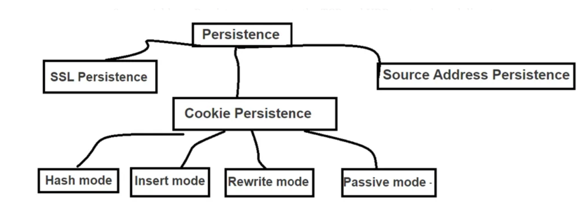

# Best Practices to Configure BIG-IP LTM Systems to Encrypt HTTP Persistence Cookies

CISA has observed cyber threat actors leveraging unencrypted persistent cookies managed by the F5 BIG-IP Local Traffic Manager (LTM) module to enumerate other non-internet facing devices on the network. F5 BIG-IP is a suite of hardware and software solutions designed to manage and secure network traffic. A malicious cyber actor could leverage the information gathered from unencrypted persistence cookies to infer or identify additional network resources and potentially exploit vulnerabilities found in other devices present on the network.  
CISA urges organizations to encrypt persistent cookies employed in F5 BIG-IP devices and review the following article for details on how to configure the BIG-IP LTM system to encrypt HTTP cookies. Additionally, F5 has developed an iHealth heuristic to detect and alert customers when cookie persistence profiles do not have encryption enabled. BIG-IP iHealth is a diagnostic tool that "evaluates the logs, command output, and configuration of a BIG-IP system against a database of known issues, common mistakes, and published F5 best practices" to help users verify the optimal operation of their BIG-IP systems.

# 📘 F5 Knowledge Base Article Reference Repository

This repository contains structured references for key F5 BIG-IP Knowledge Base articles related to:

- Cookie security  
- HTTP/ASM cookie attributes  
- Cookie encryption
- BIG-IP session cookies
- BIG-IP system-level enforcement settings  

It is designed to provide fast access for engineers, field personnel, and automation workflows.

---

## 📁 Structure

Each article is stored in its own directory:

```
F5-KB-Reference/
│
├── K13787/
├── K14784/
├── K000150090/
├── K93240866/
├── K15387/
└── K51710370/
```

Each directory contains:

```
summary.md   – High-level overview of the article  
commands.md  – Related TMSH/CLI commands  
notes.md     – Field notes & operational considerations  
links.md     – Official F5 article links  
```

---

## 📚 Articles Included

| Article | Topic |
|--------|--------|
| **K13787** | Configuring the 'secure' and 'HttpOnly' attributes for BIG-IP ASM cookies |
| **K14784** | Configuring cookie encryption within the HTTP profile on LTM |
| **K000150090** | Configuring cookie encryption within the HTTP profile on LTM |
| **K93240866** | Configuring the Secure attribute flag for the DoSL7 Proactive Bot Defense or Bot Defense Browser Verification cookie on BIG-IP ASM systems |
| **K15387** | Overview of BIG-IP APM session cookies | 
| **K51710370** | Setting the 'secure' attribute for BIG-IP ASM cookie in non-HTTPS response  |


---

## 🛠️ Example Commands

### Enable Secure & HttpOnly
```
tmsh modify ltm profile http <profile>     cookie-secure enabled     cookie-httponly enabled
```

### Enable cookie encryption
```
tmsh modify ltm profile http <profile>     cookie-encryption enabled     cookie-encryption-passphrase "YourStrongPassphrase"
```

### Global secure cookie enforcement
```
tmsh modify sys db DOSL7.use_secure_cookies value true
```

---

## 🔗 References & Resources

```
https://my.f5.com/manage/s/article/K13787
https://my.f5.com/manage/s/article/K14784
https://my.f5.com/manage/s/article/K000150090
https://my.f5.com/manage/s/article/K93240866
https://my.f5.com/manage/s/article/K15387
https://my.f5.com/manage/s/article/K51710370
https://www.cisa.gov/news-events/alerts/2024/10/10/best-practices-configure-big-ip-ltm-systems-encrypt-http-persistence-cookies
```
## Version Information

- **BIG-IP Version Tested:** 17.5.1.3
- **Purpose:** Comply with CISA's recommendations available on their website <br>
https://www.cisa.gov/news-events/alerts/2024/10/10/best-practices-configure-big-ip-ltm-systems-encrypt-http-persistence-cookies

## License

This project is intended for cookie httponly and secure settings within F5 environments.  
Use at your own risk and validate in a test environment prior to production deployment.

## Notes

- Requires F5 BIG-IP with LTM module provisioned and some more advanced cases with AWAF as well as APM enabled.
- Recommended to test changes in a **non-production** setup before deployment.
---

## 🤝 Contributing

You may contribute by adding:

- Additional F5 Knowledge articles  
- Operational notes  

---
## 🧑‍💻 Author
**Marlon Frank**  
*Network and Application Security & F5 Automation Engineer*  

This repository is not official F5 documentation—always validate changes in a test environment and reference the official articles when implementing in production.
